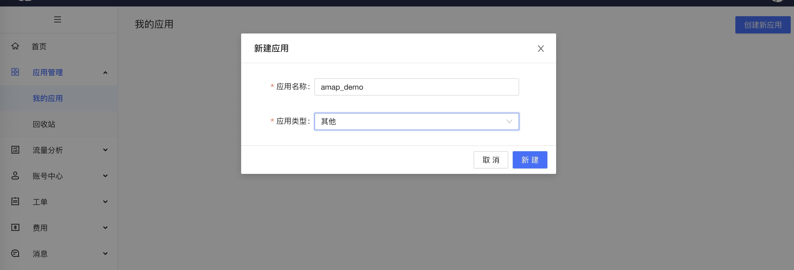
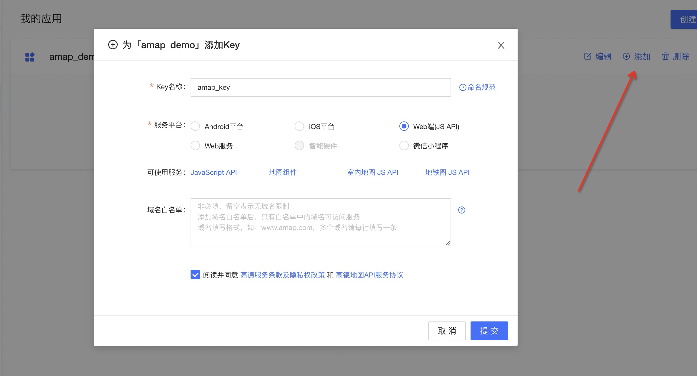
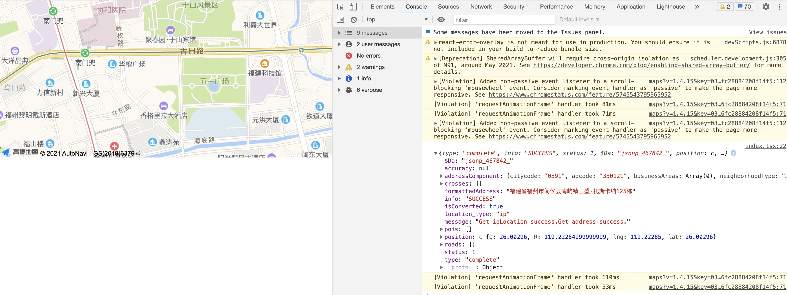
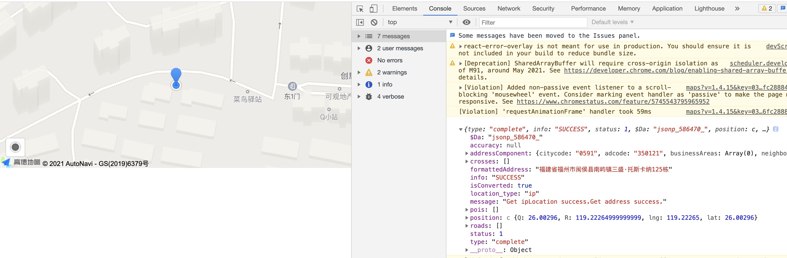
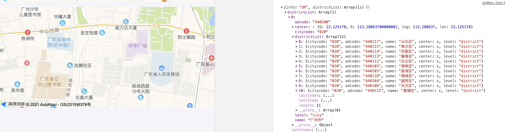
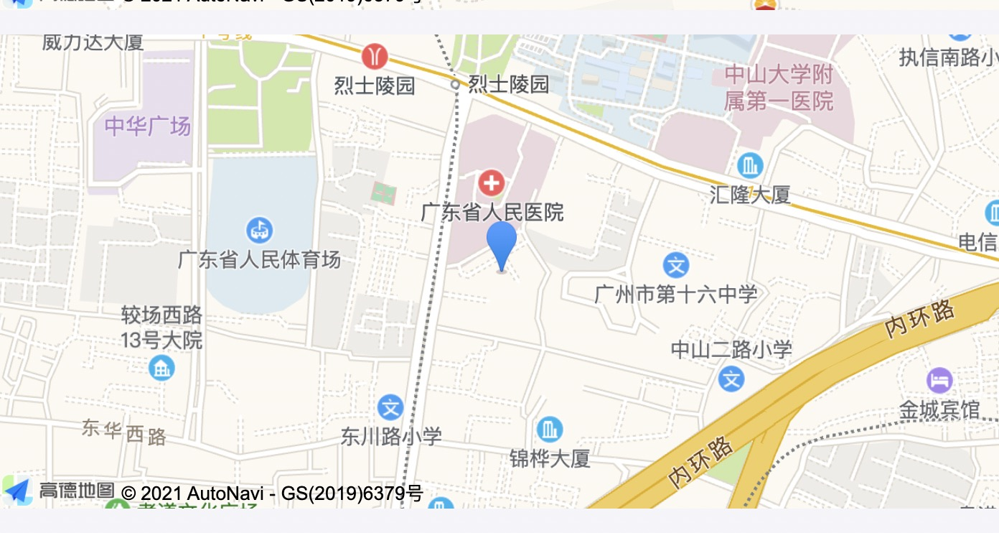

# 高德地图基础使用教程

## 简介

带大家一步步实现地图显示特定位置，或定位到当前位置。并且拖拽地图界面能够查询出指定位置周边的信息。通过关键字搜索周边信息。

本教程适合初学者。

## 一、获取使用高德api的key

打开[高德开发平台](https://lbs.amap.com/)，登录后，鼠标覆盖右上角头像，点击应用管理进入到我的应用界面。

点击右上角`创建新应用`。



为该应用添加一个 `key`。



## 二、在项目中引入地图API

在页面添加 JS API 的入口脚本标签，并将其中「您申请的key值」替换为您刚刚申请的 key；

```html
<script type="text/javascript" src="https://webapi.amap.com/maps?v=1.4.15&key=您申请的key值"></script> 
```

这里以 `alita/umi` 项目为例。在 `/src/pages/document.ejs` 文件下增加上面一行代码

```html
<!DOCTYPE html>
<html>
  <head>
    ...
    <script type="text/javascript" src="https://webapi.amap.com/maps?v=1.4.15&key=您申请的key值">
    </script>
  </head>
  <body>
    <div id="root"></div>
  </body>
</html>
```

## 三、实现地图定位

[官网API](https://lbs.amap.com/api/javascript-api/guide/services/geolocation) 可以作为参考：

在 `html` 上先写上一个 `div`。

```js
<div id="container" style={{ height: '6rem', width: '100%' }} />
```

页面初始化时，定义地图：

地图初始化加载的定位只能获取到城市级别信息，如果想获取到具体的位置就要借助浏览器定位。高德JS API提供了AMap.Geolocation插件来实现定位。

```js
useEffect(() => {
  const map = new AMap.Map('container', {
    resizeEnable: true, // 是否监控地图容器尺寸变化
    zoom: 16, // 初始化地图层级
  });
  map.plugin(['AMap.Geolocation'], () => {
    const geolocation = new AMap.Geolocation({
      enableHighAccuracy: true, // 是否使用高精度定位，默认:true
      timeout: 10000, // 超过10秒后停止定位，默认：无穷大
      zoomToAccuracy: true, // 定位成功后调整地图视野范围使定位位置及精度范围视野内可见，默认：false
    });
    geolocation.getCurrentPosition();

    AMap.event.addListener(geolocation, 'complete', (data: any) => console.log(data));
    AMap.event.addListener(geolocation, 'error', (e: any) => console.log(e));
  });
}, []);
```

**在本地开发，受环境因素影响，可能存在延迟，等项目部署后，定位速度会有显著提高。**所以小伙伴们不要着急。



那么现在地图每次初始化就会定位到终端所在的当前位置。地图定位成功后，触发 `complete` 事件，所带参数包含：定位成功与否，以及定位的经纬度的信息。

**若未定位的小伙伴可以检查下浏览器的定位功能以及电脑的定位功能是否已经开放**

> 提示：谷歌浏览器在信号不好的地方可能会对定位进行限制，导致无法定位到当前的位置。可以切换成火狐浏览器试试。

上述提示全属个人想法，与本人无关。

## 四、在当前位置及拖拽后的位置增加覆盖物

[Marker 覆盖物 API](https://lbs.amap.com/api/javascript-api/guide/map/map-layer)

```js
map.addControl(geolocation); // 在图面添加定位控件，用来获取和展示用户主机所在的经纬度位置
AMap.event.addListener(geolocation, 'complete', (data: any) => {
  const marker = new AMap.Marker({
    map,
    position: [data.position.getLng(), data.position.getLat()],
    cursor: 'move',
    // 设置拖拽效果
    raiseOnDrag: true,
  });
});
```

`map.addControl(geolocation)` 很重要，有了 `addControl` 地图上的控件才会生效。可以参考[官网地图控件API](https://lbs.amap.com/api/javascript-api/guide/overlays/toolbar)



当拖拽地图时，希望覆盖物定位图标能够始终保持在地图中间。所以我们需要监听地图的拖拽动作。

```js
map.addControl(geolocation); // 在图面添加定位控件，用来获取和展示用户主机所在的经纬度位置
AMap.event.addListener(geolocation, 'complete', (data: any) => {
  // 省略部分代码
  const marker = new AMap.Marker({...});
  // 这里写了一个方法
  map.on('moveend', () => { mapMove(map, marker) });
});
```

```js
/**
  * 地图拖拽后事件
  */
const mapMove = (map: any, marker: any) => {
  const mapCenter = map.getCenter();
  marker.setPosition([mapCenter.lng, mapCenter.lat]);
};
```

## 五、查询定位周边信息

通过第四点，我们已经能够通过定位获取到当前所在位置的经纬度以及城市信息。

```js
AMap.event.addListener(geolocation, 'complete', (data: any) => {
  ... // 这里省略部分代码
  getCurrentAddr([data.position.getLng(), data.position.getLat()], map);
})
```

输入提示插件、根据关键字获取对应城市里相关的POI信息，可以参考[官网-输入提示与POI搜索](https://lbs.amap.com/api/javascript-api/guide/services/autocomplete) 模块。

```js
AMap.service(['AMap.PlaceSearch'], () => {
  // 构造地点查询类
  const placeSearch = new AMap.PlaceSearch({
    pageSize: 20, // 单页显示结果条数
    pageIndex: 1, // 页码
    // city: "010", // 兴趣点城市
    citylimit: true, // 是否强制限制在设置的城市内搜索
    children: 1,
    //  map, // 展现结果的地图实例
    // panel: "panel", // 结果列表将在此容器中进行展示。
    autoFitView: true, // 是否自动调整地图视野使绘制的 Marker点都处于视口的可见范围
  });
  placeSearch.searchNearBy(
    '',
    lnglat,
    200,
    (status: string, result: { poiList: { pois: React.SetStateAction<never[]> } }) => {
      console.log(status, result);
    },
  );
});
```



若希望每次地图拖拽完都重新查询地图中心的周边信息。可以在 `mapMove` 的方法上增加 `getCurrentAddr` 的方法。

## 六、地图显示特定的城市

当有需求需要展示特定的城市信息，比如福州、厦门等。而不是有详细的地址。那么应该如何处理。

这里提供一个方案，未必是最好的，仅供参考。

思路：通过城市搜索到其下一级行政区的数据。如果有数据，则获取到第一条数据，拿到经纬度展示在地图上。

参考[官网-获取下级行政区信息](https://lbs.amap.com/api/javascript-api/guide/services/district-search)

```js
AMap.plugin('AMap.DistrictSearch', () => {
  var districtSearch = new AMap.DistrictSearch({
    // 关键字对应的行政区级别，country表示国家
    level: 'province',
    //  显示下级行政区级数，1表示返回下一级行政区
    subdistrict: 1,
  });

  // 搜索所有省/直辖市信息
  districtSearch.search('广州', (status: any, result: any) => {
    console.log(result);
    // 查询成功时，result即为对应的行政区信息
    if (status === 'complete') {
      const districtList = result.districtList[0];
      const center = [districtList.center.lng, districtList.center.lat];
      // 定位到指定的城市
      const mapTwo = new AMap.Map('con', {
        resizeEnable: true, // 是否监控地图容器尺寸变化
        zoom: 16, // 初始化地图层级
        center,
      });
    }
  });
});
```

至此地图已经完美的定位到我们想要的城市，若我们希望在特定城市的中心增加覆盖物进行展示，并查询特定城市的周边信息。

## 七、给特定城市展示覆盖物

```js
// 定位到指定的城市
const mapTwo = new AMap.Map('con', {
  resizeEnable: true, // 是否监控地图容器尺寸变化
  zoom: 16, // 初始化地图层级
  center,
});

const marker = new AMap.Marker({
  map: mapTwo,
  position: center,
  // 设置是否可以拖拽
  // draggable: true,
  cursor: 'move',
  // 设置拖拽效果
  raiseOnDrag: true,
});

mapTwo.on('moveend', () => {
  const mapCenter = mapTwo.getCenter();
  marker.setPosition([mapCenter?.lng, mapCenter?.lat]);
});
```

并且拖动地图时能够重新修改覆盖物。




